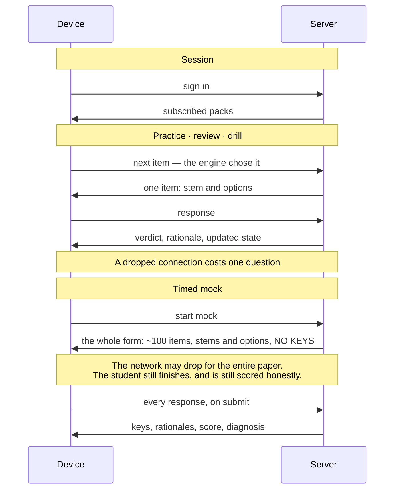
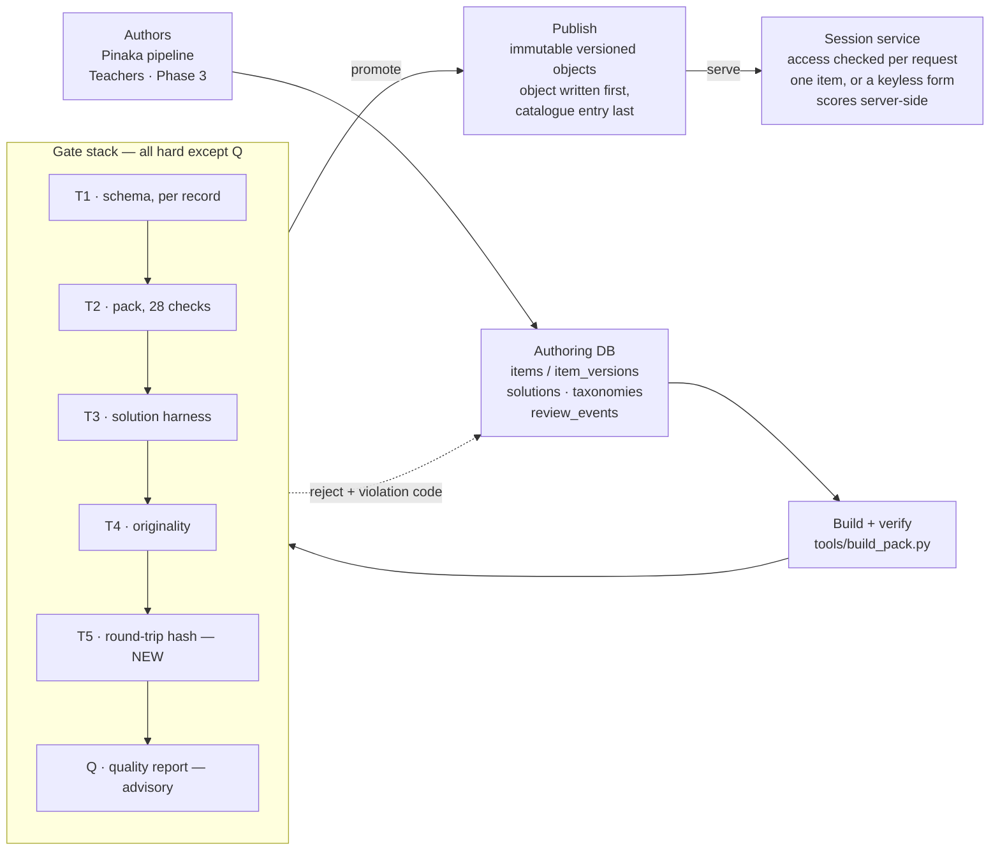
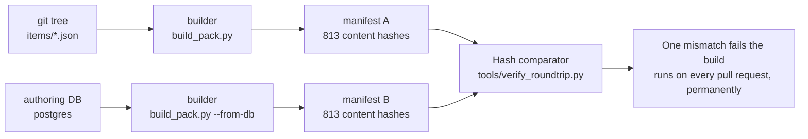
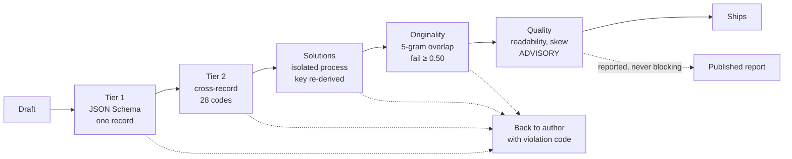

# Platform evolution: from one verified pack to an open question platform

Status: proposal, not a decision. Load-bearing choices here become ADRs before any
code is written; this document is the reasoning that would justify them.

Four aspirations sit behind this plan: move question authoring into a database, widen
beyond CA Foundation to other learner tracks, open authoring to teachers and
professors, and support the full range of question types and notation. They are
sequenced so that none of them destroys the one asset that currently works — a bank of
813 questions that has never shipped a wrong answer key.

**Scope note.** This plan covers the free, openly licensed platform only. Contributed
modules are free to students; no module store and no per-module charging is proposed
here. Where a phase needs an access check, it is about exam integrity and about which
packs a student follows. The project's existing commercial licensing for businesses
(`COMMERCIAL.md`, `LICENSING.md`) is unaffected and out of scope for this document.

---

## 1. One fact orders the entire plan

**Gate B is unsettled and the app has never been deployed.** `ROADMAP.md` defines Gate B
as "real aspirants return, find the diagnosis accurate, and improve", and lists the
deploy job as still unwired — ADR 0008 chose Cloudflare Pages, but no deploy workflow
exists in `.github/workflows/`.

Every one of the four aspirations is a bet that the diagnosis loop is worth scaling. If
the loop does not change outcomes for a CA aspirant, it will not change them for a
Grade 7 student either, and an open contribution platform built on top of it gives
teachers a distribution channel to nobody. The cheapest way to be wrong is to find out
now, with one pack and forty students.

So the plan front-loads two things in parallel: **ship and measure**, and **do the
infrastructure work that all four aspirations need anyway** — which is almost entirely
about removing the assumption that there is exactly one pack. That work is safe,
reversible, and useful whichever way Gate B lands.

---

## 2. What already exists and carries forward unchanged

Four pieces of the architecture were built for exactly this expansion and need no
redesign.

| Asset | Why it carries |
|---|---|
| **Core / Profile schema split** | `schema/core/` is exam-agnostic; a Profile specialises it with `allOf` + `$ref`. "Add an exam by adding a Profile" is already the stated contract. NEET, JEE, CLAT and a Class 8 syllabus are Profiles, not rewrites. |
| **The verification machine** | Tier 1 structure, Tier 2 cross-record, a sandboxed solution harness that re-derives every answer key, an originality gate, and a closed misconception canon. The hardest thing in the repo to rebuild, and the thing open contribution most endangers. |
| **Event-sourced engine** | ADR 0009 makes the event log the only truth: derived state rebuilds from events plus the current pack, with re-scoring on key fixes and taxonomy migration maps. That design is indifferent to where it runs, so moving the log to a server changes its address, not its logic. |
| **Pack-as-fetched-data** | ADR 0027 already made the pack an HTTP fetch behind `PackNetworkPort`, rather than a bundled module. Pointing that fetch at an authenticated session service is a change of URL, auth header and granularity — the seam was cut in the right place. |

---

## 3. Where each aspiration hits a wall

Each of the four runs into something the project has already decided in writing. None is
fatal; each needs a superseding ADR, and one needs counsel before a line of code.

### 3.1 Questions in a database — tractable

Two questions hide inside this one, and they have different answers.

**Where content is authored** is straightforward: a database, for reasons that have
nothing to do with scale. 813 JSON files is nothing; git handles it fine. The real
drivers are concurrent multi-author editing, access rules, and a review workflow, none
of which git-plus-pull-requests serves once non-engineers are writing.

**How content reaches a student** is the harder one, settled in §5 below. Short version:
streaming questions from a server is right for practice and wrong for a timed mock, so
the answer is per-mode, not one rule for everything.

> **Ruling.** Split the planes. A database becomes the *authoring* source of truth.
> Delivery stays immutable and content-hashed, but is served per session rather than as
> a whole pack downloaded to the device.

### 3.2 Tracks for every learner type — sequence it

The Profile mechanism has never been exercised by a second profile, so "the Core rarely
changes" is an untested claim — ADR 0016 says as much. About 35 hard-coded references
to `ca-foundation-qa`, across 18 files and not counting tests, sit in the Python
validators and content tools, `tools/ci-local.sh`, `.github/workflows/ci.yml`,
`app/vite-plugin-pack.mjs`, and the app's taxonomy, misconception and blueprint imports.

Deeper: **school is not exam prep.** The engine computes a readiness band against a
paper. A Grade 5 student has no paper. School needs a second goal model — syllabus
coverage and mastery across a term, driven by what a teacher assigned this week — not a
readiness percentage. Board fragmentation (CBSE, ICSE, and each state board, times ten
grades, times six subjects) is a taxonomy surface far larger than all the exams combined.

> **Ruling.** One new profile at a time, each chosen to stress the Core in exactly one
> new direction. Exams before school: they reuse the readiness model. School is a
> separate product decision, not the next pack.

### 3.3 Open teacher contribution — blocked on consent design

Contribution itself is well served by what exists. Teachers keep their copyright and
sign the CLA once; their modules ship under CC BY-NC-SA 4.0 like everything else;
ShareAlike keeps derivatives open. The existing licences do this job without
modification, which is worth stating plainly because it removes what would otherwise be
the hardest blocker in the plan.

**What does block it is DPDP 2023.** ADR 0014's entire argument is "no personal data is
processed, so consent machinery is not triggered". Accounts plus Grade 5–10 students
means processing children's personal data, which under DPDP requires verifiable parental
consent and bans behavioural tracking of minors. That applies from the moment sign-in
ships, whether or not anything is ever charged for.

**The real risk is quality collapse.** The entire trust story is "every item has an
executable solution that re-derives the key; zero wrong keys shipped". Open contribution
is the fastest way to destroy that, and no licence or consent design protects against it.

> **Ruling.** Contributed content becomes a separate pool with a visible verification
> tier, never silently mixed into the machine-verified bank. Accounts belong to teachers,
> parents and schools; a student joins by class code and the record held about them stays
> minimal. Counsel reviews the consent design before the first account is created.

### 3.4 CMS and full content fidelity — wide, not deep

`item_type` is a two-value enum. ADR 0016 already reserved `multi_select` and
`stimulus_group` behind a Profile capability flag — that groundwork is done.
Assertion-reason, matrix match, fill-in-the-blank and JEE integer-type are not. Each new
type costs four layers: schema shape, answer-key shape, an event `response` shape (so a
schema version bump), marking config, engine scoring, renderer, and validator checks.

ADR 0015 is unicode-first with KaTeX pre-approved as the escape hatch at ≤ 150 KB. NEET
chemistry and JEE mathematics trigger that hatch. Biology diagrams need the asset
pipeline, which the CA Profile disables outright (`assets_allowed: false`). The build
already sits at 1.775 MB against a 2.0 MB ceiling, so a global renderer bundle has
nowhere to go.

> **Ruling.** Content bytes stop being a client problem once the server serves items per
> session, so the budget question narrows to the shell and to renderers, which load by
> Profile capability. And the real CMS requirement is not a rich editor — it is a
> submit → validate → review → publish pipeline that shows a teacher their errors in the
> browser. That validator is already written, in Python, in this repo.

---

## 4. Five phases

Quality gates come before openness on purpose. Opening authoring has two hard problems —
content quality at scale, and moderation — and taking them one at a time is the
difference between a fixable failure and an unfixable one.

| Phase | Duration | What it does | Exit |
|---|---|---|---|
| **0 — Ship what exists** | 3–4 weeks | Wire the Cloudflare Pages deploy job. Run the closed beta with real CA Foundation aspirants. Replace the quarantined item. Harden accessibility and performance on a low-end Android handset. No new architecture. | Gate B answered with evidence: return rate, whether students agree the diagnosis named the right weakness, and whether measured mastery moved. Runs concurrently with Phase 1 and gates Phases 2 onward. |
| **1 — Accounts, catalogue, end of the single pack** | 10–13 weeks | Content authoring moves to a database. Students sign in and subscribe to packs. A catalogue lists what is available; a session service delivers questions per mode. Progress lives on the server. No external authors. | A student signs in on a second device and finds their history intact; a new pack becomes subscribable without anyone editing app code; and the CA pack built from the database is byte-identical to the one built from git. |
| **2 — Second Profile and its item types** | 8–12 weeks | Prove the Core generalises with one Profile the CA Profile never exercised. Enable `multi_select` and `stimulus_group` from ADR 0016. Add assertion-reason. Trigger the KaTeX escape hatch, lazy-loaded per Profile. Turn the asset pipeline on with mandatory alt text and licensed-source provenance. | Two Profiles in production with a Core diff small enough to review in one sitting. That diff size *is* the test of the Core/Profile claim. |
| **3 — Open authoring** | 10–14 weeks | The authoring CMS: a browser editor per item type, the Python validators exposed as a service so a teacher sees Tier 1 and Tier 2 errors as they write, a review queue, visible verification tiers, and a takedown path. Accounts already exist, so this adds teacher and school roles, class codes, and the first dashboards. | External teachers publishing verified modules that students actually complete, with moderation load, abuse patterns and review cost measured on real traffic. |
| **4 — Breadth** | ongoing | The remaining exam Profiles, the school-curriculum goal model, classroom dashboards, and the difficulty recalibration loop that ADR 0006 reserved IRT fields for. | Open-ended. Each new Profile should cost less than the one before it; if it does not, the Core is wrong and that is the signal to stop and fix it. |

---

## 5. The delivery model: does it have to be an app?

No. And the premise is worth correcting first.

**A PWA is a website.** There is no app store, no download, no installer and no version a
student has to keep current. They open a URL in a browser. "Install to home screen" is an
optional browser prompt that can be ignored forever, and nothing depends on it.

The decision actually under the question is different: **does the pack go to the device
at all, or does a server send questions after a login?** That is ADR 0001 and ADR 0008 —
project decisions, not laws, and the ADR process exists precisely so they can be replaced.

### 5.1 What improves with accounts and a server

Aspiration 3 settles this on its own. "Teachers can analyse the results" is impossible
while data stays on the device. The moment teacher dashboards exist, accounts and
server-side progress exist. The no-backend plank is going regardless.

- **Progress follows the student.** Today it moves by exporting and importing a file.
  Every student who switches phone or clears storage feels it.
- **Errata land instantly.** Fix a key, everyone has it on their next question. No
  manifest handshake, no staged download, no client-side re-score of local history.
- **No size ceiling.** The 2.0 MB budget, per-pack eviction and storage pressure on cheap
  Android all disappear. This matters enormously once NEET biology diagrams exist.
- **Roughly 2,000 lines deleted.** Of 15,500 lines in `app/src/`, about 2,000 are
  service-worker and storage machinery that exist only to serve offline: the sahpool VFS,
  the degraded mode, the staging and swap, the single-connection tab lock.

### 5.2 The one argument that cuts the other way

**A two-hour timed paper that dies at minute 90 because the train went into a tunnel.**
Not a hypothetical for this cohort, and the highest-stakes, least-forgiving moment in the
product. A student who loses a mock to your connectivity does not come back.

Secondary but real: metered data, where one pack fetched on wifi and practised all week
costs less than streaming every question; latency inside a test where seconds are scored;
and hosting cost, since a free product that serves every question from a server has a
bill and nothing offsetting it.

### 5.3 The resolution: decide per mode

Login, subscriptions, cross-device sync and teacher dashboards do **not** require
streaming questions one at a time. They are independent axes, and the current design only
conflates them because there is no backend at all.

**The mock prefetch carries no answer keys.** That single detail does most of the work:
the paper survives a total network loss because everything needed to *sit* it is already
on the device, while everything needed to *score* it stays on the server until the
student submits. It is also the cleanest guarantee of exam integrity — a student cannot
read a key out of the client before answering, because it was never sent.

| Mode | How questions arrive | If the network drops | Why |
|---|---|---|---|
| **Practice, drill, review** | One item per request, chosen server-side by the engine | Costs one question; resume where you were | Low stakes and naturally paced |
| **Timed mock** | The whole form prefetched at start — stems and options only | Nothing. The paper finishes; responses queue and submit on reconnect | The one moment where a failure is unrecoverable |
| **Scoring and diagnosis** | Server-side, from submitted responses | Deferred until reconnect, with the elapsed-time policy already in ADR 0009 | Keys never leave the server before submission, and teacher dashboards need the data there anyway |

### 5.4 What this costs

| Cost | What it means in practice |
|---|---|
| **Hosting stops being free** | A per-student serving cost against a product that is free for students. A real number to model before committing, not an afterthought. |
| **DPDP becomes mandatory** | Accounts mean personal data. With Grade 5–10 in scope that means verifiable parental consent, a ban on behavioural tracking of minors, and breach obligations. ADR 0014's "we process nothing personal" defence ends the day login ships. |
| **An availability obligation** | Today a server outage costs nothing, because there is no server. After this, an outage means nobody studies, during exam season, at 11pm. |
| **A new security surface** | Auth, sessions, password reset, PII at rest. None of it exists in the repo today, and all of it is a category of bug the project has never had to carry. |
| **The harness boundary moves** | The solution harness is safe today largely because CI holds no secrets. Once database and auth credentials exist, that argument expires and the harness job needs provable segregation. |

### 5.5 A product question sits underneath the technical one

"Choose the right pack while writing the exam" describes a **module catalogue**: browse,
pick, attempt, see a score. The current thesis is a **coach**: it knows what you got wrong
three weeks ago and resurfaces it on schedule, against one syllabus, over months.

Both are real products with different retention mechanics — a catalogue lives on breadth,
a coach on the depth of one relationship. The risk is drifting from the second into the
first because the first's interface was easier to build. Worth deciding on purpose.

### 5.6 Which recorded decisions this replaces

| ADR | Fate | Why |
|---|---|---|
| **0008** Storage and hosting | **Superseded** | The sahpool VFS choice, the 2.0 MB ceiling, the eviction posture and the free-static-host assumption all rest on there being no server. |
| **0014** Anonymous telemetry | **Superseded** | Its whole argument is that no personal data is processed. Accounts end that. The replacement has to be a real consent design, reviewed by counsel. |
| **0009** Pack and data lifecycle | Partly survives | Event sourcing, storing the raw response, and the re-score rule stay and become server-side. The manifest handshake, staging area and atomic client swap mostly go. |
| **0001** PWA over desktop shell | Survives | Still a browser app. |
| **0027** Pack is fetched data | Survives | Already the right shape. The fetch target moves from a static CDN file to an authenticated API. |
| **0004**, **0015**, **0016** | Untouched | None depend on where content is stored or how it is delivered. |

---

## 6. Phase 1 rollout strategy

The delivery decision moves identity into this phase. That is a real scope increase —
roughly three weeks — and it is worth taking, because Phase 3 assumes accounts exist, and
retrofitting identity underneath a live cohort is far more expensive than starting with it.

### 6.1 Scope

**In scope**

- Postgres as the authoring source of truth for items, solutions, taxonomies and packs
- The pack builder parameterised over any pack directory or database pack
- Sign-in, subscription to a pack, and server-side progress that follows the student
- A catalogue API listing available packs, and a session service that serves items per mode
- Mock prefetch: the whole form, stems and options, no answer keys until submission
- A second trivial pack that exists only to prove the pipeline is generic

**Explicitly not in scope**

- External authors or any browser-based editor
- Teacher dashboards and classroom analytics
- New item types, KaTeX, or the asset pipeline
- A real second exam Profile with real content
- Any change to the engine's mathematics or the event record it consumes

> **Do the consent design before the login screen, not after.** The moment sign-in ships,
> DPDP applies, and the cohort includes minors. Age assurance, the parental-consent path,
> what is stored about a child and for how long, and who can see it are design decisions
> that shape the schema — they are not a banner added later.

### 6.2 Architecture

**The seam is the whole design.** Left of `Publish` everything is mutable, attributed and
online. Right of it nothing is ever rewritten — a pack version is superseded, never
edited. The builder is the only crossing, and it cannot be bypassed: a record that fails
any hard gate goes back to its author rather than forward to a device.

### 6.3 Workstreams

#### WS-1 · Parameterise the build and the validators (weeks 1–2)

About 35 references across 18 files, not counting tests, assume the CA pack is the only
pack. The table lists the ones on the build and gate path. The content tools
(`run_quality.py`, `check_originality.py`, `funnel.py`, `content_status.py`,
`gap_analysis.py`) and the app's profile imports (`engine/topics.ts`, `state/appData.ts`,
`flows/diagnosis/DiagnosisFlow.tsx`) need the same change. Mechanical rather than small,
and it unblocks everything else.

| Path | Change |
|---|---|
| `packs/ca-foundation-qa/build_and_validate.py` | Becomes `tools/build_pack.py <pack-dir>`. The `PACK_ID`, `PACK_VERSION` and `MIN_APP_VERSION` module constants move into a per-pack `pack.toml`. |
| `schema/validate.py:33` | `PROFILE_PATH` takes an argument; with none given, it discovers every profile under `schema/profiles/`. |
| `schema/validator/run_checks.py:30` | Same for `PROFILE_DIR`. Tier 2 runs once per pack, not once. |
| `tools/ci-local.sh:36,42` | Loop the solution harness and the pack build over every pack directory. |
| `app/vite-plugin-pack.mjs:23` | `PACKS_DIR` becomes a glob. |
| `.github/workflows/ci.yml` | Matrix the pack jobs. One red pack must not hide a green one. |

**Done when** a throwaway ten-item smoke pack, under its own minimal Profile, passes
Tier 1, Tier 2, the solution harness and the originality gate with no code edited outside
its own directory.

#### WS-2 · Authoring database and the round-trip proof (weeks 2–5)

The migration is only safe if it is provably lossless, and the proof is cheap: the pack is
content-hashed already, so a database-built pack and a git-built pack must hash
identically, item for item.

| Path | Change |
|---|---|
| `db/schema.sql` | Tables for `items`, `item_versions`, `solutions`, `profiles`, `taxonomies`, `misconceptions`, `packs`, `pack_versions`, `assets`, `review_events`. Item versions immutable and hash-keyed. |
| `tools/import_pack_to_db.py` | One-way import of the 813 items and their solutions. Idempotent. |
| `tools/build_pack.py` | Gains a `--from-db` source. Identical output, identical gates, identical stamping through `canonical.py`. |
| `tools/verify_roundtrip.py` | Builds both ways and diffs the manifests. Any hash mismatch fails CI. |

Keeping this check in CI after cutover is what stops the git mirror and the database
drifting apart later — the failure mode that actually bites, six months on, when someone
edits the wrong one.

**Done when** all 813 content hashes match across both build paths.

#### WS-3 · Identity, subscriptions and consent (weeks 3–7)

New to this phase, and the piece with the longest legal tail. Build the smallest identity
that serves Phase 3 without inviting data you do not need — every field stored about a
student is a field that has to be justified, secured, retained and deleted on request.

| Path | Change |
|---|---|
| auth service | Email or phone sign-in, sessions, revocation. No social login in this phase: each provider is a separate DPDP data-sharing analysis. |
| `db` · accounts, subscriptions | An account subscribes to packs — "which packs you follow", always free. |
| `db` · consent, age assurance | Age band, consent record with timestamp and version, guardian link where required, retention clock. Designed with counsel *before* the login screen. |
| progress sync | The event log becomes server-side and authoritative. Append-only, idempotent by `event_id` — the same merge rule ADR 0009 already specifies for import, now running continuously. |
| export and delete | A student exports everything and deletes their account, end to end, in this phase. Under DPDP this is an obligation, and far cheaper to build now than to retrofit. |

**Done when** an account signs in on a second device and finds identical history; and an
account can be fully exported and fully erased, verified against every table.

#### WS-4 · Catalogue and the session delivery service (weeks 5–8)

Two surfaces with different postures. The catalogue is public, cacheable and boring. The
session service is authenticated and access-checked on every request.

| Route | Behaviour |
|---|---|
| `GET /v1/catalog` | Public and cacheable: `{pack_id, title, exam, profile, version, item_count, taxonomy_version}`. |
| `GET /v1/session/next` | Practice and review. Returns one item — stem, options, **no key** — chosen by the engine for this account. |
| `POST /v1/session/respond` | Takes the raw response, returns verdict, rationale and updated state. The raw response is what gets stored, per ADR 0009, so a later key correction can re-score it. |
| `POST /v1/mock/start` | Returns the whole assembled form — stems and options for every item, **no answer keys**. This one response is what lets the paper survive a total network loss. |
| `POST /v1/mock/submit` | Accepts every response at once, scores server-side, and only then returns keys, rationales and the diagnosis. Idempotent, because it will be retried after a reconnect. |

**Done when** a mock is started, the network is cut for its entire duration, the paper
finishes, and submission on reconnect scores correctly with no lost responses.

#### WS-5 · Rework the client onto the service (weeks 6–10)

Mostly deletion, which is the good kind of large change.

| Path | Change |
|---|---|
| `app/src/sw/` · `app/src/storage/` | About 2,000 lines shrink hard. The sahpool VFS, degraded mode, the single-connection tab lock, the staging area and the atomic swap all go. What survives is a session cache for an in-flight mock and a queue for responses awaiting reconnect. |
| `app/src/pack/source.ts` | `loadRawPack()` — one pack, memoised at module scope — becomes the session client. The in-flight-promise dedupe is worth keeping; the whole-pack assumption is not. |
| `app/src/engine/caPack.ts` | Statically imports `blueprint.json` and `marking.json` from the CA profile directory. These come from the service per pack, or every new Profile needs an app release. |
| `app/src/engine/` — split point | Decide what the client still computes. Recommended: the server is authoritative for mastery, scheduling and selection; the client keeps enough to render progress without a round trip. One authority, never two. |
| `app/src/flows/` — new | Sign-in, the pack catalogue, subscribe and unsubscribe, and an account screen carrying export and delete. |
| `app/scripts/check-offline.mjs` | Its meaning changes: no longer "everything works offline" but "an in-flight mock survives a total network loss". Narrower, and a promise that can actually be kept. |

**Done when** the mock-resilience check passes on a real low-end handset in flight mode,
and no code path still assumes a whole pack is present locally.

#### WS-6 · Record the decisions (throughout)

ADRs are immutable here; a changed decision gets a new record that supersedes the old one,
and the old one stays as history.

| ADR | Content |
|---|---|
| `0028-content-database-authoring-plane.md` | Content is authored in a database; delivered content stays immutable and content-hashed. Extends ADR 0009 and ADR 0027. |
| `0029-accounts-and-server-side-progress.md` | The product gains identity. Names what is stored, why each field is needed, and what is deliberately not stored. |
| `0030-per-mode-delivery.md` | Streamed for practice, prefetched without keys for a mock, scored server-side. States the offline promise the product now makes. |
| `0031-supersedes-0008-storage-and-hosting.md` | Retires the sahpool VFS choice, the 2.0 MB ceiling and the free-static-host assumption, and records the hosting cost accepted in their place. |
| `0032-supersedes-0014-consent-and-childrens-data.md` | Replaces "anonymous by construction" with a real consent design under DPDP, including minors. Reviewed by counsel. |
| `0033-contributed-content-is-a-separate-pool.md` | Decided now, enabled in Phase 3. Contributed content carries a visible verification tier and never silently joins the machine-verified bank. |

### 6.4 Rollout in five stages

Each stage is independently revertible. The existing offline app stays in production,
serving the git-built pack, until the last stage — so at no point is there a window with
nothing working.

| When | Stage | What happens | Rollback |
|---|---|---|---|
| weeks 1–5 · invisible | **Shadow build** | WS-1 and WS-2 land. The database is imported and both build paths run in CI, compared by hash. Production untouched. | Delete the database. Nothing user-facing has changed. |
| weeks 3–7 · legal track | **Consent design signed off** | WS-3's schema work waits on this. Counsel reviews age assurance, the parental-consent path, what is held about a minor, retention and erasure. Runs in parallel so it is not on the critical path. | None needed — but this is the one stage that can genuinely stop the phase, and finding that out in week 4 is much better than in week 9. |
| weeks 7–9 · internal only | **Service behind a login wall** | WS-3 and WS-4 land on a preview deployment, reachable only by the team. Exercise access checks on every endpoint, the keyless mock prefetch, idempotent submit, and account export and erasure end to end. | Tear down the preview. Production is a separate deployment. |
| weeks 9–12 · opt-in beta | **Real students, both apps live** | WS-5 lands. The beta cohort is invited to the account-based app while the offline app keeps running for everyone else. The mock-resilience test happens here, on real handsets in flight mode. | Send the cohort back to the offline app. Their server-side history exports and re-imports through the existing ADR 0009 envelope, which already merges idempotently. |
| week 13 · production | **Cutover** | Everyone moves. The offline app stays deployed for one more release. The round-trip check stays in CI permanently. | Repoint at the static build, still published. Rehearsed at least once before cutover. |

### 6.5 Exit gates

| Gate | Measured by | Bar |
|---|---|---|
| **Lossless migration** | `tools/verify_roundtrip.py` in CI | 813 of 813 content hashes identical across both build paths |
| **Pipeline is generic** | The smoke pack's pull request | A new pack becomes subscribable with zero edits outside its own directory |
| **Progress follows the student** | A two-device test, plus history imported from the offline app | Identical state on both devices; no event lost or duplicated |
| **The mock survives the network** | A real low-end handset in flight mode | Network cut for the full paper duration; the paper finishes and submission on reconnect scores correctly |
| **Keys stay server-side** | Inspection of every response the client can obtain | No answer key, rationale or explanation reaches the device before that item is submitted |
| **Erasure is real** | An account deleted, then every table checked | Nothing identifying the account survives, checked automatically rather than eyeballed once |
| **History intact** | New engine golden vectors | Server-side replay is deterministic and matches the client engine's existing vectors exactly |
| **Reversible** | A rehearsed rollback drill | Cohort returned to the offline app with history intact, verified end to end |

### 6.6 What will go wrong

| Risk | Why it bites | Mitigation |
|---|---|---|
| **Consent design blocks the phase** | Counsel comes back in week 9 with a requirement that reshapes the account schema, after it has been built | The legal track starts in week 3 and gates WS-3's schema. The single most likely cause of the phase overrunning. |
| **Two sources of truth drift** | The database and `items/*.json` disagree, and nobody knows which is right | The database is truth from cutover; the git tree becomes a generated mirror, and the round-trip check fails CI if they diverge |
| **The mock loses a response** | A queued response is dropped on reconnect and a student is scored on 97 of 100 questions. Unrecoverable trust damage | Idempotent submit keyed by `event_id`, the queue persisted before the request is attempted, and a reconciliation the student can see |
| **Serving cost outruns the plan** | Free product, per-question serving, exam season concentrates load into a few weeks | Model the cost per active student before week 3. If it does not survive 10,000 students, the delivery split needs revisiting while it is still cheap to revisit. |
| **An outage lands in exam season** | A promise the product has never had to keep | Decide the availability target explicitly, and keep the mock prefetch generous enough that anyone mid-paper is unaffected |
| **Scope creep into Phase 3** | "While we are building accounts, let us let teachers in" | No contributor role, no editor, no review queue enters this phase |
| **Phase 0 starves** | Infrastructure is more fun than chasing forty beta students | Gate B evidence is a named Phase 1 exit condition even though the work sits in Phase 0 |

---

## 7. The pipeline, stage by stage

A stage is not a step someone performs; it is a state a record is in, and a gate is the
condition for leaving it.

| # | Stage | What happens | Artefact | Gate to leave |
|---|---|---|---|---|
| 1 | **Draft** | An author writes a stem, options, per-option rationales and an executable solution. Nothing is frozen. | A mutable working row | Editor-side lint only |
| 2 | **Submit** | The record is frozen and canonically hashed. From here the hash, not the row id, is the identity a student's event log references. | `content_hash`, an immutable `item_versions` row | **T1** — JSON Schema, Core composed with Profile |
| 3 | **Assemble** | Every submitted record for a pack is gathered and stamped. Checks that need the whole set can only run here. | Candidate `pack.json` | **T2** — 28 cross-record checks |
| 4 | **Execute** | Every solution runs as its own isolated OS process and must re-derive the stated answer key. | Per-item pass or fail, with a reason | **T3** — solution harness |
| 5 | **Attest** | Word 5-gram containment measured against one-way hashes of published exam-board papers. | A containment score per item | **T4** — fail at 0.50, warn at 0.30 |
| 6 | **Report** | Readability, answer-position balance, rationale thinness, difficulty skew. | A quality report | **Q** — never blocks, always published |
| 7 | **Prove** | The pack is built from both the database and the git tree and the manifests compared hash for hash. | A manifest diff | **T5** — round-trip equality *(new)* |
| 8 | **Promote** | Pack and manifest are written to immutable versioned object paths, and only then does the catalogue row appear. | `/packs/<id>/<version>/` | **P** — catalogue / object consistency *(new)* |
| 9 | **Deliver** | The session service resolves access and serves what the mode needs. A promotion never lands mid-mock — an in-flight form is pinned to the version it started on. | Items on the student's screen | **D** — access and version pinning *(new)* |
| 10 | **Re-score** | Where an item's hash changed, events carrying the old hash are re-scored from the stored *raw response* against the corrected key. Recorded as a system event. | A corrected mastery state | **G** — engine golden vectors |

> **Why stage 10 must not be cut.** The whole correction story depends on events storing
> the raw response rather than a computed verdict — ADR 0009 notes this explicitly as a
> correction to the Python prototype, which dropped it. Any new item type added in Phase 2
> must carry a response shape that is re-scorable the same way, or it silently breaks this.

---

## 8. The validation mechanism

Five stations. Four can reject; the fifth only reports. Mechanical facts block a build;
judgement calls do not — a gate on a judgement call is a gate that gets argued with, and
eventually turned off.

### 8.1 The four rules that make a gate trustworthy

1. **Executable, never a checklist.** Every gate is a program that exits non-zero. Nothing
   is a box a human ticks, because a box a human ticks under deadline is a box that gets
   ticked.
2. **Coded, and pointed at a record.** A failure emits a stable violation code and the id
   of the record that caused it — `STEM_ANSWER_LEAK` on `arn_caf_qa_000412`, not
   "validation failed". In Phase 3 this code is what a teacher sees in the browser.
3. **Verdict declared up front.** Hard or advisory is a property of the gate, fixed when it
   is written.
4. **Proven able to fail.** Every check ships a fixture that must trip it. The repo already
   does this — `schema/validator/packs/reject/` and `check_originality.py --self-test`.

### 8.2 One real gap in rule 4

The reject fixtures already assert the right thing. `run_checks.py` maps each of the 20
fixtures under `schema/validator/packs/reject/` to the exact set of violation codes it
must produce, and fails if an expected code is missing or an unexpected one appears. A
fixture cannot pass by tripping the wrong check.

The gap is coverage. `pack_validator.py` emits 28 Tier 2 violation codes, and the
fixtures' expected sets name 21 of them. Seven have no fixture anywhere in the repo:
`ASSET_OWNER_MISMATCH`, `COMMON_ERROR_EQUALS_ANSWER`, `DIFFICULTY_NOT_IN_SCALE`,
`EXPLANATION_KIND_WITHOUT_SECTIONS`, `HASH_ERROR`, `RATIONALE_BAD_OPTION` and
`UNPUBLISHABLE_LICENSE`. Nothing fails when a new code is added without one.

**Fix, a few hours:** add fixtures for the seven, and a coverage check that fails CI when a
code emitted by `pack_validator.py` appears in no fixture's expected set. Do it in Phase 1,
while there are 28 codes rather than the 60-odd that Phases 2 and 3 add.

### 8.3 What the solution harness guarantees

| Property | Enforced as | What it does not cover |
|---|---|---|
| **Isolation** | `python3 -I`, separate OS process, fresh temp working directory, environment cleared to `PATH` only. The harness never imports solution code. | Not a kernel sandbox. Network egress is not blocked at the process level. |
| **Resource bounds** | 5 s CPU, 256 MB address space, 1 MB file size, no core dumps, 10 s wall clock. | A solution that is merely slow is indistinguishable from one that is wrong. |
| **Protocol** | A wrapper calls `solve()` and expects exactly one JSON object on stdout. | Nothing — this one is airtight, deliberately. |
| **Blast radius** | Fork pull requests run with a read-only token, no secrets mounted, ephemeral runners. | This is the *real* boundary. It holds today because there are no secrets in CI. Phase 1 introduces database and auth credentials, so the harness job must be provably segregated from them. |
| **Coverage** | Every quantitative item. Logical-reasoning items are verified by constraint solvers or brute-force enumeration where structure allows. | An item whose answer cannot be computed — a history date, a legal principle, a comprehension inference. Phase 3 lives here. |

> **The verification problem Phase 3 cannot code its way out of.** "Zero wrong keys
> shipped" is true because a program re-derives every key. A teacher writing a
> comprehension question cannot supply that program.
>
> The answer is not to weaken the claim but to narrow it. Three verification tiers,
> assigned mechanically, displayed on every module, never averaged into a single score:
> *machine-verified* (a solution re-derives the key in CI), *expert-reviewed* (two
> qualified reviewers independently solved it without seeing each other's answer, and
> agreed), *community-contributed* (validated for structure, not for correctness). A
> student always knows which one they are practising on.

### 8.4 Every threshold currently in force

All provisional and documented as such in `quality.py`. They were set before the bank
existed and should be re-tuned against beta data, not defended.

| Threshold | Value | Verdict | Protecting against |
|---|---|---|---|
| Originality containment | ≥ 0.50 | **hard** | Near-verbatim reuse of a published exam-board question |
| Originality containment | ≥ 0.30 | warn | Reported for review; a competent paraphrase escapes both bars, and the tool says so |
| Near-duplicate similarity | ≥ 0.80 | advisory | The bank quietly asking the same question twice |
| Answer position share | 0.10 – 0.40 | advisory | A correct-option position a student could learn to guess |
| Answer position spread | ≤ 0.25 | advisory | Same, measured across the whole pack |
| Longest-option-is-correct rate | ≥ 0.35 | advisory | The oldest test-taking heuristic there is |
| Difficulty skew | ≥ 0.85 at one level | advisory | A bank that cannot discriminate because it is all one difficulty |
| Misconception overuse | ≥ 0.25 share | advisory | A tag applied so widely it stops diagnosing anything |
| Blueprint part share | ± 0.15 | advisory | A mock that does not mirror the real paper's mix |
| Byte budget | 2.0 MB gzip | **hard** | A first load a student on a weak connection abandons |
| Contrast ratio | 4.5:1 / 3.0:1 large | **hard** | Unreadable text, enforced statically without a browser |

---

## 9. Gate registry

### 9.1 Already running in CI

| Gate | Where | Asserts | Verdict |
|---|---|---|---|
| **Tier 1 schema** | `schema/validate.py` | Each record conforms to Core composed with its Profile; accept and reject fixtures behave | **hard** |
| **Tier 2 pack** | `validator/run_checks.py` | 28 cross-record checks: duplicate ids and hashes, stem answer leaks, distractor equals key, unknown misconception, rationale coverage, notation, taxonomy version | **hard** |
| **Solution harness** | `validator/run_solutions.py` | Every solution re-derives its own answer key inside resource limits | **hard** |
| **Originality** | `tools/check_originality.py` | No item overlaps a published exam-board question above the containment bar | **hard** |
| **Engine golden vectors** | `engine-ts` vitest | Mastery, scheduling, selection and readiness are byte-stable against committed vectors | **hard** |
| **Python cross-check** | `crosscheck/run_compare.sh` | An independent implementation agrees with the engine on the core mathematics | **hard** |
| **Byte budget** | `app/scripts/check-size.mjs` | Gzipped first load stays under 2.0 MB; warns above 1.5 MB | **hard** |
| **Offline resolution** | `app/scripts/check-offline.mjs` | Every precached shell asset resolves | **hard** |
| **Accessibility** | `app/scripts/check-a11y.mjs` | Contrast, 12 px type floor, touch targets, focus visibility, reduced motion — statically, no browser | **hard** |
| **Dependency audit** | `tools/audit-gate.mjs` | No new advisories; the three shipping dependencies are never allowlisted | **hard** |
| **Typecheck, lint, tests** | app and engine | Ordinary code hygiene on both packages | **hard** |
| **Home-path hygiene** | `ci.yml` | No absolute local paths leak into tracked files | **hard** |
| **CLA signature** | `cla.yml` | Every contributor has signed before merge | **hard** |
| **Content quality** | `validator/run_quality.py` | Readability, answer-position balance, near-duplicates, difficulty skew, blueprint mix | advisory |

### 9.2 Phase 1 must build

| Gate | Asserts | Build or extend |
|---|---|---|
| **Round-trip equality** | The database build and the git build produce identical content hashes for all 813 items | new — `tools/verify_roundtrip.py` |
| **Violation-code coverage** | Every code `pack_validator.py` emits appears in at least one reject fixture's exact expected set | extend — `run_checks.py` already asserts exact sets; this adds the coverage check that closes the rule 4 gap |
| **Per-pack isolation** | Each pack is gated independently in a CI matrix; one red pack cannot mask a green one | extend — `ci.yml` |
| **Catalogue consistency** | No catalogue row without its object; the manifest hash matches the stored object; no published version is ever rewritten | new — publish pipeline |
| **Access check on every endpoint** | No item-bearing response is served without a subscription check. Asserted per route, so a new endpoint cannot quietly omit it | new — session service |
| **Keys never leak early** | No answer key, rationale or explanation appears in any response the client can obtain before that item is submitted | new — contract test over every route |
| **Mock resilience** | A full-length paper started, the network cut for its entire duration, the paper completed and submitted correctly on reconnect | rewrite — `check-offline.mjs` narrows to this |
| **Submit idempotency** | The same submission replayed under concurrency scores once, loses no response, and duplicates none | new — keyed by `event_id` |
| **Erasure completeness** | A deleted account leaves nothing identifying behind, checked against every table | new — DPDP obligation |
| **Secret segregation** | The solution harness job provably cannot reach database or auth credentials | new — the CI-has-no-secrets argument expires this phase |
| **Server replay parity** | Server-side replay of an event log matches the client engine's existing golden vectors exactly | new — golden vectors |

### 9.3 Phases 2 and 3 will owe

| Phase | Gate | Asserts |
|---|---|---|
| 2 | **Capability conformance** | A pack may not use an item type its Profile has not enabled — the enforcement ADR 0016 promised |
| 2 | **Answer-key shape** | Each item type carries the key shape it declares: `correct_set` for multi-select, tolerances for integer entry, pair maps for matrix match |
| 2 | **Response re-scorability** | Every new response shape can be re-scored from the raw stored response, so stage 10 keeps working |
| 2 | **Notation lint per Profile** | Unicode allowlist, or a delimited TeX subset where a Profile opts in. No raw HTML, no unbounded LaTeX |
| 2 | **Asset integrity** | Alt text present and non-trivial, content hash matches the bytes, MIME on the allowlist, dimension and byte caps, no dangling references |
| 2 | **Asset provenance** | Every image declares an origin and a licence. The largest legal exposure the platform takes on |
| 2 | **360 px legibility** | Formula-bearing items remain readable at the low-end device width, as ADR 0015 requires |
| 3 | **No bypass** | External submissions traverse the identical gate stack. No reviewer override, no fast path |
| 3 | **Tier assignment** | Verification tier is derived from evidence, never self-declared by the author |
| 3 | **Independent double-solve** | For items no program can verify, two reviewers solved it without seeing each other's answer, and agreed |
| 3 | **Contributor originality** | Containment run against the reference set *and* against the existing bank, so contributors cannot resubmit Pinaka items |
| 3 | **CLA on file** | A signed CLA exists before anything that contributor wrote can publish |
| 3 | **Moderation and takedown** | A reported module is reviewable within a stated window, and a takedown removes it from the catalogue without corrupting the history of students who already practised it |

---

## 10. Decisions owed

One of these now blocks Phase 1 rather than Phase 3, because sign-in moved forward.

| Decision | Recommendation |
|---|---|
| **Children's data** — no longer deferrable; it lands the moment sign-in ships. DPDP demands verifiable parental consent for minors and bans behavioural tracking of them. | Accounts belong to teachers, parents and schools. A student joins by class code and the record held about them stays minimal — identifiers for progress, nothing more. Counsel signs this off before the schema is written. |
| **Which Profile is second** — the choice should maximise what it teaches about the Core per unit of content cost, not market size. | CLAT or a single NEET subject. Both are readiness-against-a-paper, so the engine is reused; each stresses one new axis — stimulus groups for law, notation and diagrams for science. School curriculum needs a different goal model and should not be second. |
| **Where verification stops** — "zero wrong keys shipped" is the brand, and a teacher writing a history question cannot supply an executable solution. | Verification tiers, visible on every module, never averaged away: machine-verified, expert-reviewed, community-contributed. A student always knows which one they are practising on. |
| **Contributed content and the existing licences** — CC BY-NC-SA plus the CLA appear to cover contribution without modification. | Confirm rather than assume, and record it. If it holds, no licence change is needed at all, which is worth writing down so nobody reopens it later. |
| **Coach or catalogue** — the product question in §5.5. | Decide explicitly before Phase 3 designs the discovery surface, because the two shapes pull the interface in opposite directions. |

---

Prepared against the working tree at commit `6e5ec40`. File paths, line numbers, item
counts and byte figures are read from the repository, not estimated. Phase durations
assume the current team size and are the least reliable numbers here.

The DPDP Act 2023 references identify where professional advice is needed. They are not
that advice.
