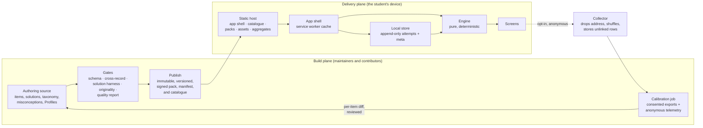

# Architecture: Pinaka Abhyas

Status: Draft for review, version 2. Owner: engineering. Drafted by product for
the engineering owner to change and own.
This page hangs from `boundary.md`, `objects.md`, and `prd.md`. It cannot
contradict them. It describes the system to be built, not the code that exists.

## 1. What the boundary fixes, and what engineering decides

The boundary fixes six things about the system. Everything else is the
engineering owner's call.

Fixed by the boundary:

1. There are two planes. The build plane makes verified content. The delivery
   plane is static files and the student's device.
2. No student identity exists anywhere. No account, no server-side progress.
3. The app works fully offline after first load. No server call is needed to
   practise, sit a mock, or see the diagnosis.
4. The engine runs on the device. All AI runs at build time.
5. Calibration is a build-time batch job with a human review before it ships.
6. The app code is open source, and the shipped claims can be checked in it.

Engineering decides where content is authored, the frameworks, the storage
engine, the host, how the collector is built, the CI layout, and every internal
interface. Where this page names a technology, it is marked "proposed". The
requirement is the property the technology must give, and another technology
that gives it is equally acceptable.

## 2. The two planes

Left of Publish, everything is mutable, attributed, and online. Right of
Publish, nothing is ever rewritten. A pack version is superseded, never edited.
The only crossing is the builder. A record that fails a gate goes back to its
author, never forward to a device.

## 3. The delivery plane

### 3.1 The app shell

| Id | Requirement |
|---|---|
| A-1 | The app is a progressive web app. It has one origin, a web manifest, a service worker that caches the shell, and an install prompt the student can ignore forever. |
| A-2 | Three runtime dependencies ship to the browser: the component framework, its DOM binding, and the local database build. Every other dependency is a build or test tool. The proposed stack is TypeScript with a bundler that removes unused code. |
| A-3 | The first-load budget is 2.0 megabytes transferred, gzipped, as a hard gate, with a warning above 1.5. The reason is a first load on a slow connection that a student abandons. |
| A-4 | Renderers for notation and for new item types load per Profile capability, not in the first load. A student on CA Foundation never downloads a formula renderer. |
| A-5 | Assets are addressed by content hash, fetched when first needed, and cached by the service worker. |
| A-6 | The service worker serves the shell cache-first. The catalogue, the manifest, the pack, and the aggregates are never served cache-first, so a check always reaches the network when online. |
| A-7 | A strict Content Security Policy applies: no inline scripts, no third-party scripts, and only the WebAssembly permission the local database needs. The exact directive depends on the browser floor in section 5.4 and must be verified there. |
| A-8 | A global error boundary shows a plain-language screen with a copy-the-details action and a link to the report channel. A render error is never a blank screen. |
| A-9 | Time to interactive on the base device is measured in CI with a browser under a throttled network and CPU profile. The proposed target is under five seconds on a cold load and under two seconds warm. The method is the engineering owner's choice. |
| A-68 | The service worker never activates a new app version while a mock is in progress. It waits for the mock to end and activates on the next launch. |
| A-69 | The app carries a version, and the pack carries a minimum app version. An app below that version does not install the pack. It tells the student to update the app, and it keeps the pack it has. |
| A-70 | Every string a student sees lives in one resource file with a language code. No text lives in code. This is what makes a second language possible later. |

### 3.2 The content contract

The student's device reads five kinds of file from the host. All five are
static.

| Id | Requirement |
|---|---|
| A-10 | The catalogue is one signed JSON file at a stable URL. It lists every pack: pack id, exam, title, version, item count, taxonomy version, minimum app version, and the path to its manifest. |
| A-11 | Each pack lives at an immutable versioned path. A new version is a new path. Nothing at an old path ever changes. |
| A-12 | The manifest carries the pack id, the version, the taxonomy version, the item count, the minimum app version, the creation time, a content hash per item, a hash of the whole pack file, and the errata for this version. |
| A-13 | The app verifies the hash of the fetched pack bytes against the manifest before it stores anything. A mismatch is discarded and shown to the student as a failed update. |
| A-14 | The catalogue and every manifest are signed. The app ships a set of public keys, each with an id and an expiry. It rejects an unsigned, wrongly signed, or expired signature. |
| A-15 | The update flow is this. Check the catalogue and the manifest on launch when online. Compare versions. Show the size and ask before downloading on a metered connection. Download to a staging area. Verify. Swap when no mock is in progress. Keep the previous version until the swap succeeds. |
| A-16 | A mock is pinned to the pack version it started on. The swap waits. |
| A-17 | When a manifest lists a key correction, the app re-scores that item's history from the stored raw responses. It records the correction and the pack version in meta, never as an attempt. It tells the student what changed. |
| A-18 | Assets carry a content hash, a media type from an allowlist, byte and dimension caps, alt text, an origin, and a licence. The build rejects any asset without all of them. |
| A-71 | The app stores the highest pack version it has installed, per pack, in meta. It rejects any manifest or catalogue that offers a lower version. This is the downgrade defence. |
| A-72 | Key rotation is a drill, written down and rehearsed: a new key is added to the app's set before the old one expires, and packs are signed with both during the overlap. A leaked key is retired by shipping an app that no longer carries it. Where the private keys are backed up is recorded with the drill. |
| A-73 | The residual risk is stated plainly. A host that can serve a bad pack can serve a bad app. The control is a reproducible build whose bundle hash is published in the repository's release notes, so anyone can compare what the host serves with what the source produces. |
| A-74 | The aggregates are one file per exam, published by the calibration job, with the spread of ability bands among students who opted in. The file states its sample size. It is signed like a manifest. |
| A-75 | A pack version can be withdrawn. Withdrawal means the catalogue stops listing it. A device that holds it keeps working until the next update. |
| A-76 | A pack carries a migration map from its previous taxonomy version. When the taxonomy version changes, the engine applies the map at replay. History is never dropped. |

### 3.3 The local store

| Id | Requirement |
|---|---|
| A-19 | The local store holds an append-only log of attempts and a key-value area for meta. Nothing else. Each attempt row carries its pack id. The proposed shape is two tables. |
| A-20 | Nothing derived is stored. Mastery, schedule, diagnosis, next action, and readiness are rebuilt from attempts and the current pack on every load. |
| A-21 | The store must survive restarts, hold the attempts and the pack, and work offline. The proposed engine is a relational database compiled to WebAssembly over the origin's private file system. An in-memory fallback exists for when durable storage is unavailable. The fallback is labelled in the app, and the export reminder is stronger in it. |
| A-22 | A schema version key lives in meta, checked on every open, with forward-only migrations. |
| A-23 | One tab writes at a time. A second tab shows a message to use the first tab. The mechanism is the engineering owner's choice. |
| A-24 | The app asks the browser to persist storage after the first session. Whether it was granted is stored and shown in settings. The answer is advisory, and the export reminder is the real protection. |
| A-25 | The export file is versioned JSON. It holds the format version, the export time, the app version, the taxonomy version, the attempts with their pack ids, the reports, the answers to in-app questions, and the settings. It holds no name, no contact detail, and no free text. |
| A-26 | Import validates the structure, caps the size, executes nothing, and merges attempts by attempt id. It takes settings only when the device has none. |
| A-77 | Import from a different pack version, taxonomy version, or exam is allowed. The app applies the taxonomy map where one exists, keeps every attempt, and tells the student what it could not use. |
| A-78 | Delete all data removes the attempts, the meta, and the student's pack copies. It leaves the shell cache. |
| A-79 | The pack file lives in the local store or in a service worker cache that the offline gate covers. A mock in flight mode is a gated test, not a hope. |
| A-80 | Storage eviction is a known risk on some browsers for an app that is not installed. The app addresses it three ways: the install prompt, the persist request, and the export reminder. The current rules per browser are recorded with the browser floor. |

### 3.4 The engine

The engine is a pure library. It takes attempts, a pack, a Profile's blueprint
and marking scheme, and a clock value. It returns state and outputs. It reads no
clock of its own and uses no randomness.

| Id | Requirement |
|---|---|
| A-27 | The inputs are the attempts, the pack's items with their topics, difficulty labels, and calibrated difficulty when present, the blueprint, the marking scheme, the current time, and the exam time if set. |
| A-28 | The outputs are mastery per topic, schedule per item, misconception occurrences, the next action, readiness, and the views the screens need. |
| A-29 | Mastery per topic is a rating and an uncertainty, updated after every attempt from the expected outcome. The expected outcome uses the item's difficulty, a guessing floor per item type, and the topic's rating. Thin topics borrow strength from their family. |
| A-30 | Item difficulty is the calibrated difficulty when the pack carries one, else an anchor per difficulty label. The engine never writes difficulty. |
| A-31 | Scheduling keeps per-item state from a spaced-repetition model, updated after every attempt in every mode. A wrong answer is a lapse and returns the exact item. The model is the engineering owner's choice. |
| A-32 | Selection returns one next action from the state, with a kind, a target, and a reason in marks. Exposure is controlled so no item is over-served. |
| A-33 | Readiness is expected marks under an answering policy that respects the marking scheme's break-even point, with a range, the distance to pass, a confidence state that never reaches high, time feasibility, and a note. Standard mocks anchor it. |
| A-34 | Every function is deterministic. Committed golden vectors pin every output, and CI replays them on every change. |
| A-35 | An independent implementation of the mastery and readiness mathematics must agree with the engine on the vectors. |
| A-36 | The engine is exam-agnostic by construction. No exam constant lives in the engine package. Every exam value comes from the Profile at run time. |
| A-37 | Every item type declares a raw response shape and a scoring function. Adding a type never changes an existing vector. |

### 3.5 Modes and the mock

| Id | Requirement |
|---|---|
| A-38 | The modes are practice, review, and mock. The app records the mode and, for a mock, its type on every attempt. Readiness reads standard mocks only. Mastery learns from every attempt. |
| A-39 | A standard mock is assembled to the blueprint with a per-topic cap, from items the student has not seen recently. Every standard form shares a set of anchor items with the other forms, so scores across sittings can be compared. |
| A-40 | The mock clock is elapsed time from the moment the mock started, kept in the store. The app reads a monotonic counter while it runs and wall time only to bridge a restart. A wall-clock jump is detected, shown to the student, and never ends a mock on its own. |
| A-41 | The mock's form and every response are written to the local store as they happen. A crash loses at most the current item. |

### 3.6 Network calls

| Id | Requirement |
|---|---|
| A-42 | The app makes exactly these requests: its own shell files, the catalogue, a manifest, a pack, assets, an aggregate, and the optional telemetry send. Nothing else. |
| A-43 | A CI gate lists every network call site in the code and fails if a call target is not on the allowlist. |
| A-44 | No third-party script, font service, or analytics script runs in the app. Fonts are self-hosted. Page counts come from the host's request logs, not from anything in the app. |

## 4. The build plane

### 4.1 Authoring and publishing

| Id | Requirement |
|---|---|
| A-45 | The authoring source is the engineering owner's choice: files in the repository, a database, or both. Whatever it is, the builder is the only path to a published pack. |
| A-46 | Every item has a content hash. A substantive edit to the stem or the options creates a new item id, because calibrated parameters describe the old item. A key correction keeps the id, changes the hash, and is listed in the errata, because the item was the same and its key was wrong. A formatting fix keeps the id and changes the hash. |
| A-47 | If two authoring sources exist, a round-trip gate builds the pack from both and fails CI on any hash mismatch. |
| A-48 | Publishing writes the pack and its signed manifest to the immutable path first, and updates the signed catalogue last. A catalogue entry never points at a missing pack. |
| A-49 | The signing keys live outside CI. A release is signed by a maintainer on their own machine, never by a workflow that a fork pull request could reach. |
| A-81 | A quarantined item stays in the pack as a marker with its replacement's id, so history keeps its meaning. The app never serves it. |
| A-82 | The errata for a pack version list every key correction and every quarantine since the previous version, in plain words, and ship in the manifest. |

### 4.2 Gates

Every gate is a program that exits non-zero. Every gate emits a stable
violation code and the id of the record that caused it. Every gate ships a
fixture that must trip it, and a coverage gate fails when a code has no
fixture.

| Gate | Asserts | Verdict |
|---|---|---|
| Schema | Each record conforms to the Core composed with its Profile. | hard |
| Cross-record | Pack-wide checks pass: no duplicate ids or hashes, no stem that leaks its answer, no distractor equal to the key, no unknown misconception, no missing rationale, no notation outside the allowlist, one taxonomy version. | hard |
| Solution harness | Every executable solution re-derives its own key in an isolated process with resource limits. | hard |
| Originality | No item overlaps a published exam-board question above the containment bar, measured against one-way hashes of the reference papers. | hard |
| Capability | No item uses a type its Profile has not enabled. | hard |
| Key shape | Each item type carries the key shape it declares. | hard |
| Re-scorability | Every response shape can be re-scored from the raw response. | hard |
| Asset integrity | Alt text, hash, media type, caps, origin, and licence are present, and no reference dangles. | hard |
| Manifest | Every content hash matches its item, the pack hash matches the bytes, the errata name real items, and the signatures verify. | hard |
| Round trip | Two authoring sources build identical hashes. | hard, when two sources exist |
| Violation coverage | Every code a gate can emit appears in a fixture. | hard |
| Byte budget | The first load is under 2.0 megabytes gzipped. | hard |
| Offline | Every precached shell asset and the installed pack resolve with no network. | hard |
| Network allowlist | Every call target is on the list. | hard |
| Accessibility | Contrast, the type floor, touch targets, focus, and reduced motion pass. Static checks run on the source, and a rendered check runs on every screen. | hard |
| Width | Every item renders legibly at the width floor. | hard |
| Golden vectors and cross-check | Engine outputs are byte-stable and match the independent implementation. | hard |
| Dependency audit | No new advisory exists, and the three shipping dependencies are never allowlisted. | hard |
| Quality report | Readability, answer-position balance, near-duplicates, difficulty skew, and blueprint mix are reported. | advisory, always published |

### 4.3 Profiles

| Id | Requirement |
|---|---|
| A-50 | The Core schema is exam-agnostic and is never edited to fit one exam. A Profile extends it by composition. |
| A-51 | A Profile is a directory with a schema extension, a taxonomy, a misconception canon, a blueprint, a marking scheme, a pass rule or rank tables with sources, the enabled item types, a notation policy, and an asset policy. |
| A-52 | The builder, the gates, the CI matrix, and the app take the pack id as a parameter. No path in any tool names one exam. |
| A-53 | The second Profile is the proof. Its Core diff must be small enough to review in one sitting. If it is not, the Core is wrong and that is the signal to fix it. |

### 4.4 Calibration and the collector

| Id | Requirement |
|---|---|
| A-54 | The collector has these properties, and the engineering owner chooses how to build it. It validates a strict payload schema. It caps the size. It limits the rate per source address at the edge, before anything is stored. It drops the address before any write. It buffers rows for at least a day, shuffles them, and writes each row on its own. No batch id, no receipt time finer than a day, and no order that rebuilds a session survive. |
| A-55 | Each record carries what the PRD lists and nothing else. The ability band has five levels and is computed on the device from the student's own mastery. It is a grouping variable for the fit, never a person parameter. |
| A-83 | The app sends records in one batch per session to save metered data. The collector splits the batch on receipt and never stores it. The link between rows inside one request exists only in memory at the edge. |
| A-56 | The calibration job runs at build time on a maintainer's machine or in CI without secrets. Its inputs are consented export files as the trusted, person-linked channel, and the anonymous rows as the volume channel. |
| A-57 | The scale is anchored on the consented exports, because only person-linked responses can fix both ability and difficulty. The anonymous rows may move an item's difficulty only inside a bounded band around that anchor. The fit starts with a one-parameter model. A two-parameter model is allowed only for items past their data floor. |
| A-58 | No parameter replaces the authored anchor below a minimum response count. The proposed floor is 150 responses per item for the one-parameter model, from the knowledge base, and it is recorded with the fit. The fit shrinks toward the authored anchor. The influence of any one day of anonymous rows on any one item is capped. An item whose parameter moves more than a set amount between rounds is flagged and held. |
| A-84 | Resurfaced and review attempts are excluded from the fit, because they are not independent measures. The guessing floor per item type sits in the link function. Both channels are self-selected samples, and the job states this in its report. |
| A-85 | Calibration runs on a fixed cadence, proposed once per quarter, and after any pack version with many new items. |
| A-59 | The output is a per-item diff in a pull request. A maintainer reviews it. The change lands in the pack's calibrated block and nowhere else. |
| A-60 | The calibration job never touches an answer key, a misconception tag, or any student's device. |

### 4.5 Rank tables

| Id | Requirement |
|---|---|
| A-61 | For an exam that publishes marks and ranks, the Profile carries one table per year with the source URL and the date it was retrieved. A gate blocks a rank band feature for any Profile without one. |

### 4.6 Contribution tooling

| Id | Requirement |
|---|---|
| A-62 | The blind solve surface is a static page that loads an item with its key and explanation stripped at build time. The key never reaches that page. |
| A-63 | Solves, tag audits, and reports enter as pull requests or as files a maintainer imports. Tier assignment is computed from the evidence, never self-declared. |
| A-64 | The solution harness runs with no secrets mounted, on an ephemeral runner, with a read-only token for fork pull requests. This holds because CI holds no secrets, and the signing keys stay out of CI to keep it true. |

## 5. Hosting, release, and cost

### 5.1 Hosting

| Id | Requirement |
|---|---|
| A-65 | The host serves static files with immutable-path caching and lets the project set response headers, because the Content Security Policy is a header. A fallback host with the same properties is documented, and a gate checks header parity between the two. The choice of hosts is the engineering owner's. |
| A-66 | The shell and the packs cost bandwidth only. The collector runs on an edge free tier. Numbers are verified against the providers' current pricing before the first release and recorded with a date. |
| A-67 | A host outage blocks first loads and updates only. A student who has loaded the app once studies through it. This is the whole availability promise. |

### 5.2 Release

| Id | Requirement |
|---|---|
| A-86 | The app has a version. A release is a tagged, reproducible build whose bundle hash is published with the tag. |
| A-87 | A new app version activates on the next launch after the service worker has fetched it, never while a mock is in progress. |
| A-88 | App rollback is repointing the host at the previous release. Pack rollback is withdrawing the version from the catalogue. Both are rehearsed before the first release. |
| A-89 | Before a release, an upgrade test runs against a store with existing attempts, an export and import round trip runs, and an end-to-end run happens on a real base device. |

### 5.3 Learning that the app is broken

| Id | Requirement |
|---|---|
| A-90 | The app sends no error reports. Maintainers learn of breakage three ways: the copy-the-details action on the error screen, which the student can paste into the report channel; the closed-beta conversation; and the report-a-problem entries inside shared exports. This is a stated limit of the privacy rule, not an oversight. |

### 5.4 The browser floor

| Id | Requirement |
|---|---|
| A-91 | The project states one browser floor, per browser and version, recorded with a date. Every feature this page relies on is checked against it: the private file system, WebAssembly under the policy directive, the persist request, the lock, and the signature algorithm. |
| A-92 | The signature algorithm is chosen for the floor. The proposed default is ECDSA on the P-256 curve, because it is available on older browsers where newer curves are not. This must be verified against the floor. |

## 6. Data protection

The app processes no personal data. The project does, in three places, and
this section names them.

| Id | Requirement |
|---|---|
| A-93 | The collector sees a source address for the moment it rate-limits and then drops it. The edge provider's own access logs may keep addresses. The project records the provider's retention and turns logging off or as short as the provider allows. |
| A-94 | A consented export is personal data. It holds a timestamped history, and the maintainer who receives it knows who sent it. The project keeps such files in one place, in one region, with a named retention period, and deletes a file on request. |
| A-95 | A student under 18 shares an export only through a parent, and the consent text says so. The closed beta records consent per student before any file is received. |
| A-96 | The project writes its breach duties down before the first export is received, including the time limits the law sets, and names who acts. |
| A-97 | A counsel check on this section and on the anonymity claim in the boundary happens before the collector ships and before the first export is received outside the closed beta. |

## 7. Threat model

| Threat | Why it matters | Control |
|---|---|---|
| A bad pack served by a compromised host | A wrong key reaches every student | The signed catalogue and manifest, the hash of the pack bytes, keys outside CI, and the downgrade defence (A-13, A-14, A-49, A-71) |
| A bad app served by a compromised host | The check that protects the pack is skipped | Stated residual risk, a reproducible build, and a published bundle hash (A-73, A-86) |
| Calibration poisoning by fake telemetry | Item difficulty drifts | Unlinked rows, the trusted channel as the anchor, a bounded band, minimum counts, shrinkage, influence caps, human review, and a blast radius that excludes keys and diagnoses (4.4) |
| A malicious import file | Corrupt or hostile data on the device | Structural validation, a size cap, no execution, merge by id (A-26) |
| Content as an attack vector | Script in a stem or an option | No raw HTML, a notation allowlist, a strict policy (A-7, the cross-record gate) |
| Dependency compromise | Code in the student's browser | Three shipping dependencies, lockfiles, the audit gate, no third-party scripts (A-2, A-44) |
| A shared phone | Another person reads the student's progress | Delete all data, no name anywhere, an export the student controls (A-78) |
| The solution harness | Contributed code runs in CI | Isolation, resource limits, no secrets, ephemeral runners (A-64) |
| Re-identification through telemetry | Rows are grouped back into one student | No id, coarse buckets, a day-level receipt time, shuffled writes, and no stored batch (A-54, A-83) |
| Item leakage | A student sees the pack | Not a threat. The content is free and openly licensed, and keys on the device can only cheat the student who owns it. |

## 8. Budgets and gates on the base device

| Budget | Value | Gate |
|---|---|---|
| First load | 2.0 megabytes gzipped, warn at 1.5 | CI, hard |
| Time to interactive | Proposed under five seconds cold, two warm, on the base device | CI, measured with a throttled browser |
| Type floor | 12 pixels, no text smaller | CI, hard |
| Touch targets | 44 pixels minimum | CI, hard |
| Contrast | 4.5 to 1, 3 to 1 for large text | CI, hard |
| Width | Every screen and every item legible at 360 pixels | CI, hard, rendered |
| Offline | Every shell asset and the installed pack resolve with no network | CI, hard |

## 9. Open questions for the engineering owner

- The authoring source: files, a database, or both with the round-trip gate.
- The host and the edge provider for the collector.
- The scheduler model and the local database engine.
- How to measure time to interactive in CI.
- Whether the export file gets optional passphrase encryption.
- The browser floor, and the signature algorithm it allows.
