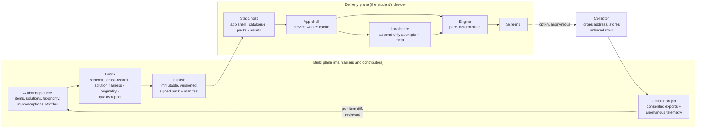

# Architecture: Pinaka Abhyas

Status: Draft for review, version 1. Owner: engineering. Drafted by product for
the engineering owner to change and own.
This page hangs from `boundary.md`, `objects.md`, and `prd.md`. It cannot
contradict them. It describes the system to be built, not the code that exists.

## 1. What the boundary fixes, and what engineering decides

The boundary fixes six things about the system. Everything else is the
engineering owner's call.

Fixed by the boundary:

1. There are two planes. The build plane makes verified content. The delivery
   plane is static files and the student's device.
2. No student identity exists anywhere. No account, no server-side progress.
3. The app works fully offline after first load. No server call is needed to
   practise, sit a mock, or see the diagnosis.
4. The engine runs on the device. All AI runs at build time.
5. Calibration is a build-time batch job with a human review before it ships.
6. The app code is open source, and the shipped claims can be checked in it.

Engineering decides: where content is authored, the frameworks, the storage
engine, the host, the collector's implementation, the CI layout, and every
internal interface. This page proposes defaults for those, marked "proposed".

## 2. The two planes

Left of Publish, everything is mutable, attributed, and online. Right of
Publish, nothing is ever rewritten. A pack version is superseded, never edited.
The only crossing is the builder, and a record that fails a gate goes back to
its author, never forward to a device.

## 3. The delivery plane

### 3.1 The app shell

| Id | Requirement |
|---|---|
| A-1 | The app is a progressive web app: one origin, a web manifest, a service worker that caches the shell, and an install prompt the student can ignore forever. |
| A-2 | Proposed stack: TypeScript, a component framework, a bundler that tree-shakes. Three runtime dependencies ship to the browser: the framework, its DOM binding, and the SQLite build. Every other dependency is a build or test tool. |
| A-3 | First-load budget: 2.0 megabytes transferred, gzipped, as a hard gate, with a warning above 1.5. The reason is a first load on a slow connection that a student abandons. |
| A-4 | Renderers for notation and for new item types load per Profile capability, not in the first load. A student on CA Foundation never downloads a formula renderer. |
| A-5 | Assets are addressed by content hash, fetched when first needed, and cached by the service worker. |
| A-6 | The service worker serves the shell cache-first. The catalogue, the manifest, and the pack are never served cache-first, so an update check always reaches the network when online. |
| A-7 | A strict Content Security Policy: no inline scripts, no third-party scripts, the WebAssembly permission the SQLite build needs and nothing wider. |
| A-8 | A global error boundary shows a plain-language screen with a copy-the-error action. A render error is never a blank screen. |
| A-9 | Time to interactive on the base device, a low-end Android phone on a slow connection, is measured in CI against a stated target. Proposed target: under five seconds on a cold load, under two seconds warm. |

### 3.2 The content contract

The student's device reads four kinds of file from the host. All four are
static.

| Id | Requirement |
|---|---|
| A-10 | The catalogue: one JSON file at a stable URL listing every pack: pack id, exam, title, version, item count, taxonomy version, minimum app version, and the path to its manifest. |
| A-11 | Each pack lives at an immutable versioned path. A new version is a new path. Nothing at an old path ever changes. |
| A-12 | The manifest carries: pack id, version, taxonomy version, item count, minimum app version, creation time, a content hash per item, and a hash of the whole pack file. |
| A-13 | The app verifies the hash of the fetched pack bytes against the manifest before it stores anything. A mismatch is discarded and reported to the student as a failed update, never installed. |
| A-14 | The manifest is signed with a key whose public half ships inside the app. The app rejects an unsigned or wrongly signed manifest. This is what stops a compromised host from serving a bad pack. |
| A-15 | The update flow: check the catalogue and manifest on launch when online; compare versions; download to a staging area; verify; swap when no mock is in progress; keep the previous version until the swap succeeds. |
| A-16 | A mock is pinned to the pack version it started on. The swap waits. |
| A-17 | When an item's content hash changes and its key changed, history for that item is re-scored from the stored raw responses, and a system attempt records that this happened. |
| A-18 | Assets carry: content hash, media type from an allowlist, byte and dimension caps, alt text, origin, and licence. The build rejects any asset without all of them. |

### 3.3 The local store

| Id | Requirement |
|---|---|
| A-19 | Two tables. Attempts: an append-only log, one row per attempt, keyed by attempt id, ordered by time then id. Meta: key and value for settings and versions. |
| A-20 | Nothing derived is stored. Mastery, schedule, diagnosis, next action, and readiness are rebuilt from attempts and the current pack on every load. |
| A-21 | Proposed engine: SQLite compiled to WebAssembly over the origin's private file system, with an in-memory fallback when that storage is unavailable. The fallback is labelled in the app, and the export reminder is stronger in it. |
| A-22 | A schema version key in meta, checked on every open, with forward-only migrations. |
| A-23 | One writer at a time across tabs, held with a web lock. A second tab reads and shows that it is read-only. |
| A-24 | The app asks the browser to persist storage after the first session. Whether it was granted is stored and shown in settings. |
| A-25 | The export file is versioned JSON: format version, export time, app version, pack id and version, taxonomy version, and the attempts. It carries no name and no personal field. Import validates the structure, caps the size, executes nothing, and merges by attempt id. |
| A-26 | Delete all data removes both tables and the service worker's copy of the student's state, and leaves the shell cache. |

### 3.4 The engine

The engine is a pure library. It takes attempts, a pack, a Profile's blueprint
and marking scheme, and a clock value. It returns state and outputs. It reads no
clock of its own and uses no randomness.

| Id | Requirement |
|---|---|
| A-27 | Inputs: the attempts, the pack's items with their topics, difficulty labels, and calibrated difficulty when present, the blueprint, the marking scheme, the current time, and the exam time if set. |
| A-28 | Outputs: mastery per topic, schedule per item, misconception occurrences, the next action, readiness, and the views the screens need. |
| A-29 | Mastery per topic: a rating and an uncertainty, updated after every attempt from the expected outcome. The expected outcome uses the item's difficulty, a guessing floor per item type, and the topic's rating. Thin topics borrow strength from their family. |
| A-30 | Item difficulty: the calibrated value when the pack carries one, else an anchor per difficulty label. The engine never writes difficulty. |
| A-31 | Scheduling: per item, a stability and a difficulty from a spaced-repetition model, updated after every attempt in every mode. A wrong answer is a lapse and returns the exact item. |
| A-32 | Selection: one next action from the state, with a kind, a target, and a reason in marks. Exposure is controlled so no item is over-served. |
| A-33 | Readiness: expected marks under an attempt policy that respects the marking scheme's break-even point, a range, the distance to pass, a confidence state that never reaches high, time feasibility, and a note. Anchored by standard mocks only. |
| A-34 | Every function is deterministic. Committed golden vectors pin every output, and CI replays them on every change. |
| A-35 | An independent implementation of the mastery and readiness mathematics, in a second language, must agree with the engine on the vectors. |
| A-36 | The engine is exam-agnostic by construction: no exam constant lives in the engine package. Every exam value comes from the Profile at run time. |
| A-37 | Every item type declares a raw response shape and a scoring function. Adding a type never changes an existing vector. |

### 3.5 Modes and the mock

| Id | Requirement |
|---|---|
| A-38 | Modes: practice, review, mock. The app records mode on every attempt. Hard and pace mocks record a training mode so readiness ignores them and mastery learns from them. |
| A-39 | A standard mock is assembled to the blueprint with a per-topic cap, from items the student has not seen recently, and is comparable across sittings. |
| A-40 | The mock clock is elapsed time computed from stored timestamps, not a running timer the student can pause by closing the app. |
| A-41 | The mock's form and every response are written to the local store as they happen. A crash loses at most the current item. |

### 3.6 Network calls

| Id | Requirement |
|---|---|
| A-42 | The app makes exactly these requests: its own shell files, the catalogue, a manifest, a pack, assets, the optional telemetry send, and the host's page analytics if enabled. |
| A-43 | A CI gate lists every network call site in the code and fails if a call target is not on the allowlist. |
| A-44 | No third-party script, font service, or analytics script runs in the app. Fonts are self-hosted. |

## 4. The build plane

### 4.1 Authoring and publishing

| Id | Requirement |
|---|---|
| A-45 | The authoring source is the engineering owner's choice: files in the repository, a database, or both. Whatever it is, the builder is the only path to a published pack. |
| A-46 | Every item has a content hash. A substantive edit creates a new item id, because calibrated parameters describe the old item. A formatting fix keeps the id and changes the hash. |
| A-47 | If two authoring sources exist, a round-trip gate builds the pack from both and fails CI on any hash mismatch. |
| A-48 | Publishing writes the pack and its signed manifest to the immutable path first, and updates the catalogue last. A catalogue entry never points at a missing pack. |
| A-49 | The signing key lives outside CI. A release is signed by a maintainer, not by a workflow that a fork pull request could reach. |

### 4.2 Gates

Every gate is a program that exits non-zero. Every gate emits a stable
violation code and the id of the record that caused it. Every gate ships a
fixture that must trip it, and a coverage check fails when a code has no
fixture.

| Gate | Asserts | Verdict |
|---|---|---|
| Schema | Each record conforms to the Core composed with its Profile. | hard |
| Cross-record | Pack-wide checks: duplicate ids and hashes, a stem that leaks its answer, a distractor equal to the key, an unknown misconception, missing rationales, notation outside the allowlist, taxonomy version. | hard |
| Solution harness | Every executable solution re-derives its own key in an isolated process with resource limits. | hard |
| Originality | No item overlaps a published exam-board question above the containment bar, measured against one-way hashes of the reference papers. | hard |
| Capability | No item uses a type its Profile has not enabled. | hard |
| Key shape | Each item type carries the key shape it declares. | hard |
| Re-scorability | Every response shape can be re-scored from the raw response. | hard |
| Asset integrity | Alt text, hash, media type, caps, origin, and licence present; no dangling reference. | hard |
| Manifest | Every content hash matches its item; the pack hash matches the bytes; the signature verifies. | hard |
| Round trip | Two authoring sources build identical hashes. | hard, when two sources exist |
| Violation coverage | Every code a gate can emit appears in a fixture. | hard |
| Byte budget | First load under 2.0 megabytes gzipped. | hard |
| Offline | Every precached shell asset resolves. | hard |
| Network allowlist | Every call target is on the list. | hard |
| Accessibility | Contrast, type floor, touch targets, focus, reduced motion, checked statically. | hard |
| Golden vectors and cross-check | Engine outputs are byte-stable and match the independent implementation. | hard |
| Dependency audit | No new advisory; the three shipping dependencies are never allowlisted. | hard |
| Quality report | Readability, answer-position balance, near-duplicates, difficulty skew, blueprint mix. | advisory, always published |

### 4.3 Profiles

| Id | Requirement |
|---|---|
| A-50 | The Core schema is exam-agnostic and is never edited to fit one exam. A Profile extends it by composition. |
| A-51 | A Profile is a directory: schema extension, taxonomy, misconception canon, blueprint, marking scheme, pass rule or rank tables with sources, enabled item types, notation policy, asset policy. |
| A-52 | The builder, the gates, the CI matrix, and the app take the pack id as a parameter. No path in any tool names one exam. |
| A-53 | The second Profile is the proof. Its Core diff must be small enough to review in one sitting. If it is not, the Core is wrong and that is the signal to fix it. |

### 4.4 Calibration and the collector

| Id | Requirement |
|---|---|
| A-54 | The collector is one small function at the edge with no runtime dependencies. It validates a strict payload schema, caps the size, rate-limits by source address, drops the address before any write, and stores each record as its own unlinked row. No batch id, no receipt time finer than a day. |
| A-55 | Each record carries what the PRD lists and nothing else. The coarse ability bucket is computed on the device from the student's own mastery. |
| A-56 | The calibration job runs at build time on a maintainer's machine or in CI without secrets. Inputs: consented export files as the trusted channel, and the anonymous rows as the volume channel. |
| A-57 | The fit starts with a one-parameter model. A two-parameter model is allowed only for items past its data floor. No parameter replaces the authored anchor below a minimum response count. The fit shrinks toward the anchor. |
| A-58 | The influence of any one day of anonymous rows on any one item is capped. An item whose parameter moves more than a set amount between rounds is flagged and held. Rows that disagree with the trusted channel are down-weighted. |
| A-59 | The output is a per-item diff in a pull request. A maintainer reviews it. The change lands in the pack's calibrated block and nowhere else. |
| A-60 | The calibration job never touches an answer key, a misconception tag, or any student's device. |

### 4.5 Rank tables

| Id | Requirement |
|---|---|
| A-61 | For an exam that publishes marks and ranks, the Profile carries one table per year with the source URL and the date it was retrieved. A gate blocks a rank band feature for any Profile without one. |

### 4.6 Contribution tooling

| Id | Requirement |
|---|---|
| A-62 | The blind solve surface is a static page that loads an item with its key and explanation stripped at build time. The key never reaches that page. |
| A-63 | Solves, tag audits, and reports enter as pull requests or as files a maintainer imports. Tier assignment is computed from the evidence, never self-declared. |
| A-64 | The solution harness runs with no secrets mounted, on an ephemeral runner, with a read-only token for fork pull requests. This holds because CI holds no secrets, and the signing key stays out of CI to keep it true. |

## 5. Hosting and cost

| Id | Requirement |
|---|---|
| A-65 | The host is a static file host with immutable-path caching and custom headers for the Content Security Policy. Proposed: a free static host with a documented fallback to a second one. |
| A-66 | Cost model: the shell and packs cost bandwidth only. The collector runs on an edge free tier. Numbers are verified against the providers' current pricing before the first release and recorded with a date. |
| A-67 | Availability: a host outage blocks first loads and updates only. A student who has loaded the app once studies through it. This is the whole availability promise. |

## 6. Threat model

| Threat | Why it matters | Control |
|---|---|---|
| A bad pack served by a compromised host | A wrong key reaches every student | Signed manifest, hash of the pack bytes, key outside CI (A-13, A-14, A-49) |
| Calibration poisoning by fake telemetry | Item difficulty drifts | Unlinked rows, minimum counts, shrinkage, influence caps, trusted channel anchor, human review, and a blast radius that excludes keys and diagnoses (4.4) |
| A malicious import file | Corrupt or hostile data on the device | Structural validation, size cap, no execution, merge by id (A-25) |
| Content as an attack vector | Script in a stem or an option | No raw HTML, a notation allowlist, strict CSP (A-7, cross-record gate) |
| Dependency compromise | Code in the student's browser | Three shipping dependencies, lockfiles, the audit gate, no third-party scripts (A-2, A-44) |
| A shared phone | Another person reads the student's progress | Delete all data, no name anywhere, an export the student controls (A-26, P-69) |
| The solution harness | Contributed code runs in CI | Isolation, resource limits, no secrets, ephemeral runners (A-64) |
| Item leakage | A student sees the bank | Not a threat. The content is free and openly licensed, and keys on the device can only cheat the student who owns it. |

## 7. Budgets and gates on the base device

| Budget | Value | Gate |
|---|---|---|
| First load | 2.0 megabytes gzipped, warn at 1.5 | CI, hard |
| Time to interactive | Proposed under five seconds cold, two warm, on the base device | CI, measured |
| Type floor | 12 pixels, no text smaller | CI, hard |
| Touch targets | 44 pixels minimum | CI, hard |
| Contrast | 4.5 to 1, 3 to 1 for large text | CI, hard |
| Width | Every screen and every item legible at 360 pixels | CI, hard for items; review for screens |
| Offline | Every shell asset precached and resolvable | CI, hard |

## 8. Open questions for the engineering owner

- The authoring source: files, a database, or both with the round-trip gate.
- The host and the edge provider for the collector.
- The measurement method for time to interactive in CI without a browser.
- Whether the export file gets optional passphrase encryption.
- The signing scheme and where the private key lives.
